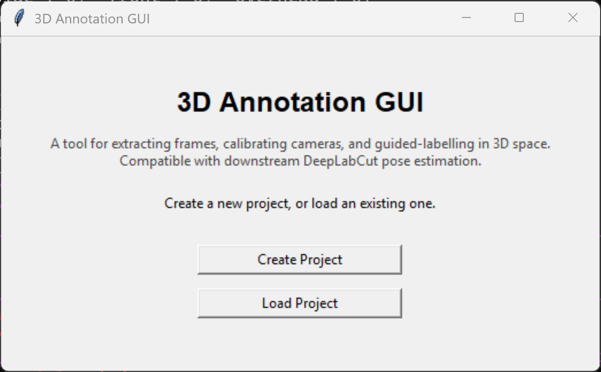
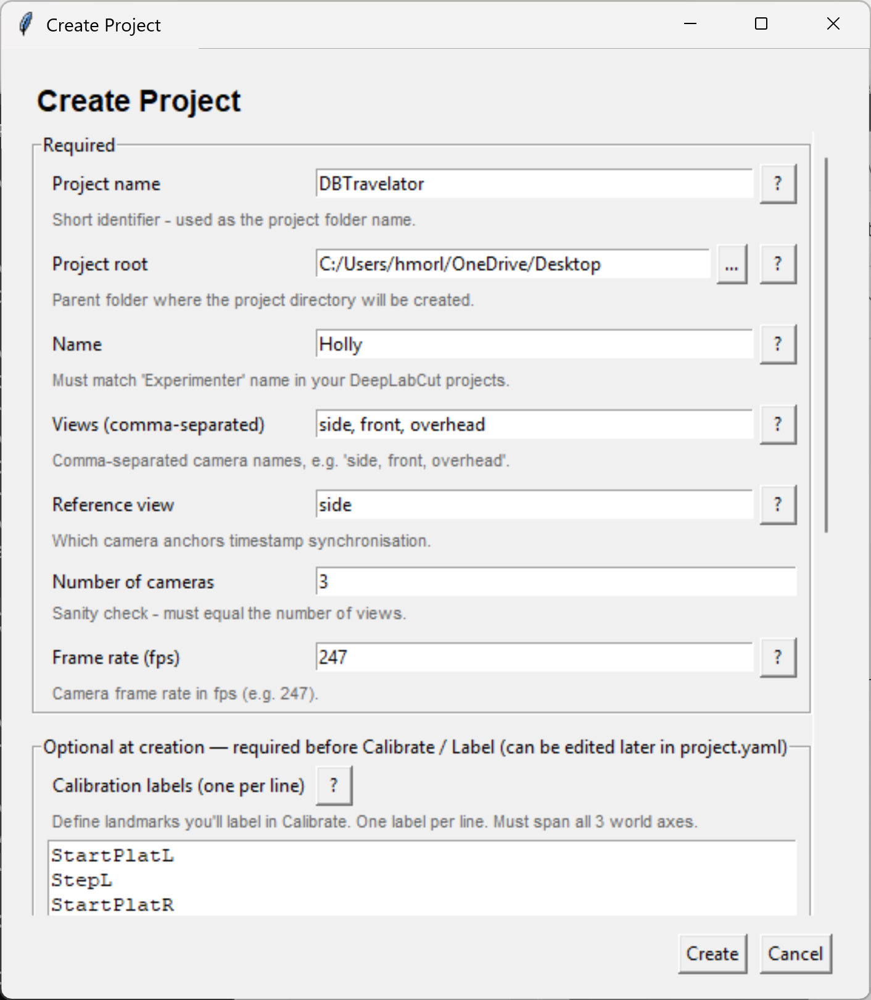
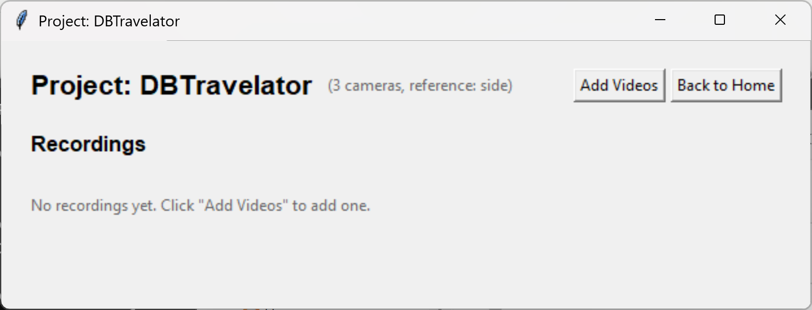
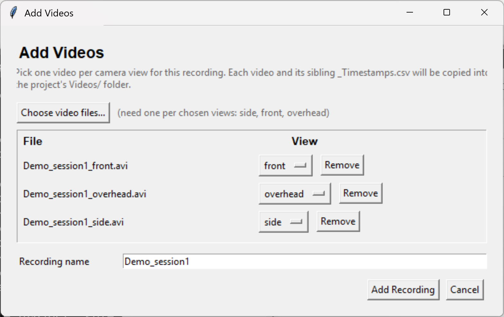
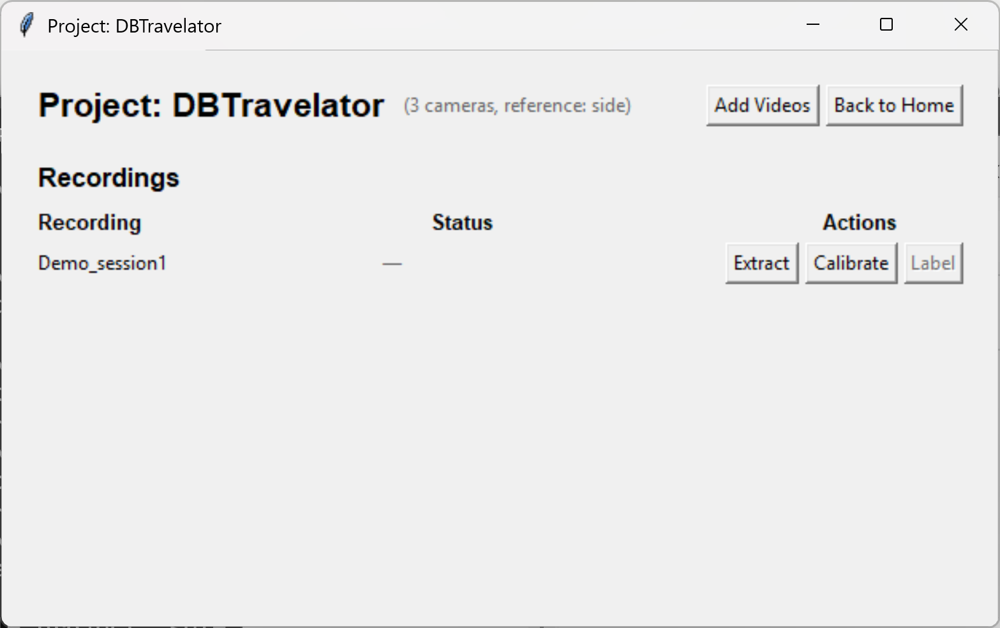
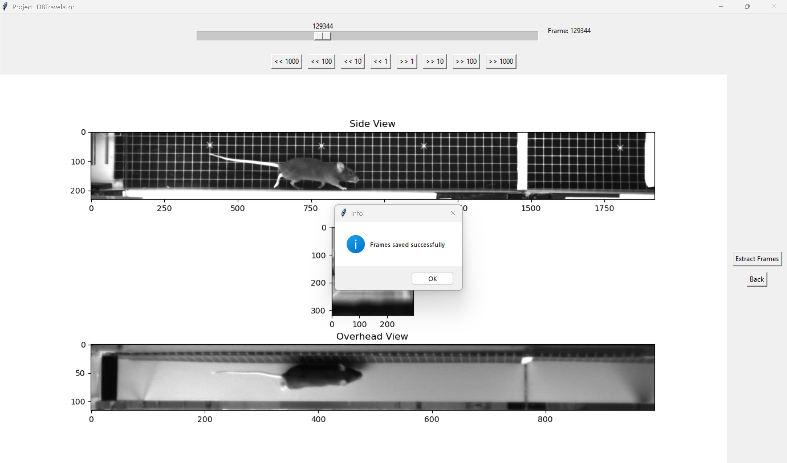
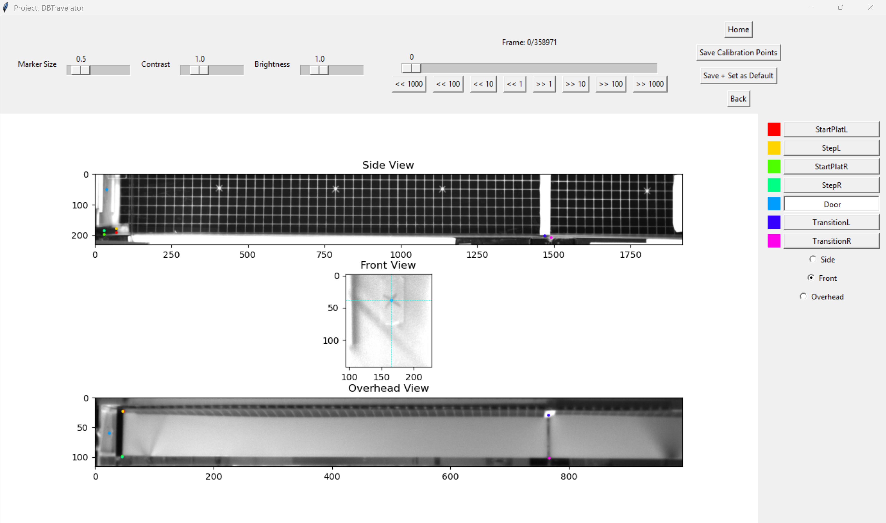
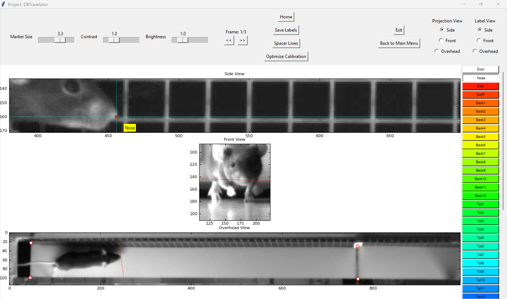

# 3D Annotation GUI

### Multi-camera labelling tool with 3D projection assistance

A tkinter-based GUI for manual annotation of body parts across N synchronised camera views (e.g.
side, front, and overhead), with real-time 3D projection lines to guide labelling. Saved labels follow
the DeepLabCut file convention so they can be fed directly into downstream DLC training.

<p align="center">
  <br>
  <em>Downstream result: labels produced with this tool were used to train DeepLabCut models (single model per camera). These multi-view predictions are then triangulated to reconstruct 3D motion.</em>
</p>

_Note: This is a personal research tool and under development (including these docs!). Future work will continue to
focus on generalising the pipeline (and adding new UX features) so it can be released as a package._

## Setup

**Sample data:** a GoogleDrive folder with sample video files is available
[here](https://drive.google.com/drive/folders/1qrT0OCMl8VSDXEYe_bXN3qvMKnHLk5hS?usp=sharing).

Create the environment:

```bash
conda env create -f environment.yml
```

Run the GUI:

```bash
conda activate 3d-annotation-gui
python -m annotation_tool
```

Run tests:

```bash
pytest tests/ -v
```

## Walkthrough

The tool is organised around the concept of a **project**: a directory containing a `project.yaml`
config plus all the videos, extracted frames, calibration data, and labels for that experiment.

### 1. Create or load a project

<p align="center">
  
</p>

Pick a name, list your camera views, define calibration and body-part labels. Optional fields can
be left blank and filled in later via `project.yaml` - commented templates are included.

<p align="center">
  
</p>

### 2. Add videos for a recording

<p align="center">
  
</p>

Click **Add Videos** to register a recording. The dialog auto-detects which view each file
belongs to from the filename (e.g. `Demo_session1_side.avi` → side view) and copies the videos
plus their timestamp CSVs into the project's `Videos/` folder.

<p align="center">
  
</p>

### 3. Run the tools

Each recording row has Extract / Calibrate / Label buttons. Buttons whose prerequisites aren't met
are greyed out - hover for an explanation of what's missing.

<p align="center">
  
</p>

**Extract** - scrub through synchronised video frames and save trios for labelling.

<p align="center">
  
</p>

**Calibrate** - label your calibration landmarks across views.

<p align="center">
  
</p>

**Label** - annotate body parts; projection lines across views guide placement.

<p align="center">
  
</p>

When you're done, **Save Labels** writes one `CollectedData_<name>.csv` (and `.h5`) per camera
view under the recording's `labels/` folder, ready to feed into DeepLabCut for model training and pose estimation.

## Tools - controls & options

### Extract Frames

- Scroll or skip through the synchronised videos and extract frame trios for labelling.
- Timestamps are used to correct for any minor frame misalignment across cameras (e.g. sporadic single frame dropping).

### Calibrate Cameras

- The default calibration landmarks (for the experiments this tool was built for) are: the
  4 corners of the first belt, the corners of the starting step edge, and the `x` sticker on
  the door - though the set is fully configurable per project.
- **Controls:** Right-click to place, Shift+Right-click to delete, Left-click drag to move.

### Label Body Parts

- **Label View** - the camera view to label in.
- **Projection View** - the view to calculate projection lines from. If labels are present in the
  selected Projection View, projection lines (back-projected from the 2D label and clipped to the
  imaging volume) are drawn on the other views to guide labelling.
- **Spacer Lines** - click once, then right-click two points on the active frame to display 12
  equally-spaced vertical guide lines along the x-axis (this will be customizable in future).
- **Optimize Calibration** - adjusts the manually labelled calibration points to minimize
  reprojection error between camera views, improving the projection estimates.
- **Save Labels** - writes one `CollectedData_<name>.csv` (and `.h5`) file per camera view under
  the recording's `labels/` folder.
- **Controls:** Right-click to place, Shift+Right-click to delete, Left-click drag to move, Hover for label name.

## Project structure (codebase)

```
annotation_tool/
├── __main__.py              # Entry point (python -m annotation_tool)
├── constants.py             # UI constants and Create Project dialog defaults
├── help.py                  # Field-level help text for the Create Project dialog
├── project.py               # Project + Recording dataclasses, YAML I/O, add_recording
├── paths.py                 # Disk-layout queries, file load/save helpers
├── camera/
│   ├── calibration.py       # CameraData, CalibrationLandmarks, InitialCalibration
│   ├── geometry.py          # Pure 3D primitives (DLT triangulation, ray-AABB clipping, etc.)
│   └── optimisation.py      # Calibration extrinsic refinement (scipy minimise)
└── gui/
    ├── app.py               # Top-level state machine (Home → Project → Tool → back)
    ├── home.py              # Create / Load Project landing screen
    ├── create_project.py    # Create Project dialog
    ├── project_view.py      # Recordings table with per-row Extract / Calibrate / Label
    ├── add_videos.py        # Add Videos dialog (auto-detects view from filename)
    ├── base.py              # Shared base class for tools (pan, zoom, sliders)
    ├── extract.py           # Frame extraction from synchronised videos
    ├── calibrate.py         # Camera calibration point labelling
    ├── label.py             # Body part labelling with 3D projection lines
    ├── sync.py              # Timestamp matching across cameras (for mild frame drop correction)
    └── utils.py             # Pure utility functions (scrolling, help button, colours)
tests/
├── test_project.py          # Project + paths.py tests
├── test_sync.py             # Frame matching tests
└── test_triangulation.py    # DLT triangulation test
```

## On-disk project layout

A project on disk looks like this:

```
my_project/
├── project.yaml             # Project config (cameras, label schemas, recordings list)
├── Videos/                  # Videos copied here when added via Add Videos
│   ├── Demo_session1_side.avi
│   ├── Demo_session1_side_Timestamps.csv
│   ├── Demo_session1_front.avi
│   └── ...
└── recordings/
    └── Demo_session1/       # Everything for one recording lives here
        ├── frames/
        │   ├── side/img0.png ...
        │   ├── front/
        │   └── overhead/
        ├── calibration/
        │   ├── labels.csv
        │   └── labels_enhanced.csv
        └── labels/
            ├── side/CollectedData_<name>.csv (+.h5)
            ├── front/
            └── overhead/
```